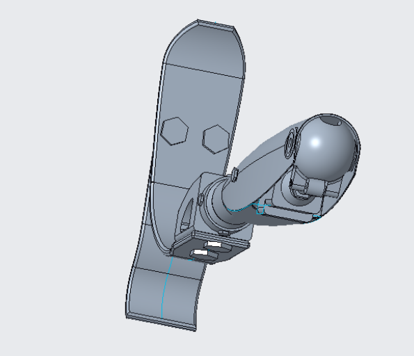

<h1>Leg Prosthesis</h1>


<h2>Description</h2>
During my bachelor studies, we had to prepare a simple object in Creo. Since I became fluent with the software, I prepared something more advanced related to the study programme Biomedical Engineering. The following leg prosthesis is a combination of the two articles that i have linked below.
<br />


<h2>Software</h2>

- <b>Creo Parametric</b>

<h2>Project</h2>

<br/> 
<p align="center">  
<p align="center">  
</p> 
<p align="center"> Figure 1: Assembly of the whole Project. 
</p>


<br/> 
<p align="center">  
</p> 
<p align="center"> Figure 2: Hydrualic system without a shaft. 
</p>


<br/> 
<p align="center">  
</p> 
<p align="center"> Figure 3: Knee. 
</p>


<br/> 
<p align="center"> 
  </p> 
<p align="center"> 
 Figure 4: Foot reconstruction. 
</p> 


<h2>Summary</h2>

According to the supervisor of my project: “So now what? Time to print!” Unfortunately, the lack of a 3D printer at that time was the only thing that stopped me. However, I gained experience in projects that are larger and more complex than just a simple bolt. 

All in all, I am happy with the results, especially for my first project in CAD software.

<h2>Sources</h2>
General idea: "Designing and Manufacturing of Lower Limb Prosthetic” - https://www.pmu.edu.sa/attachments/academics/pdf/udp/coe/dept/me/16-designing-and-manufacturing-of-lower-limb-prosthetic.pdf

Foot inspiration was taken from here: https://www.nature.com/articles/s41598-018-23705-8

<!--
 ```diff
- text in red
+ text in green
! text in orange
# text in gray
@@ text in purple (and bold)@@
```
--!>
