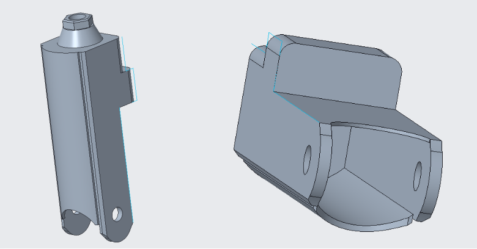
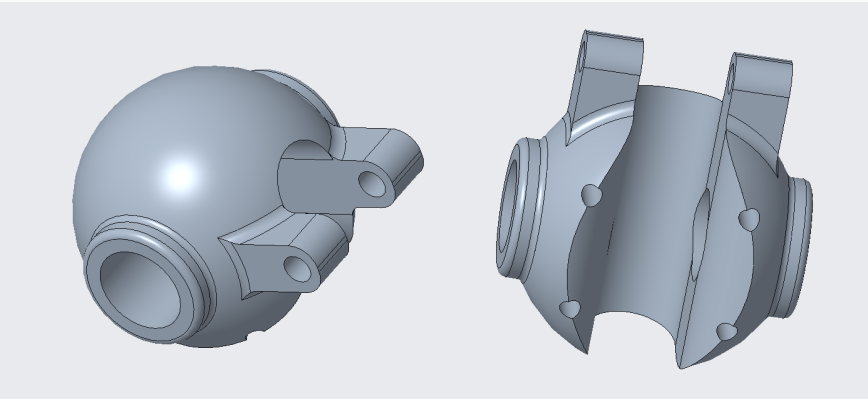
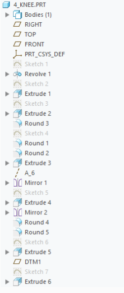
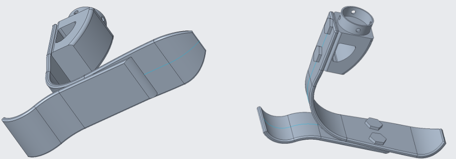
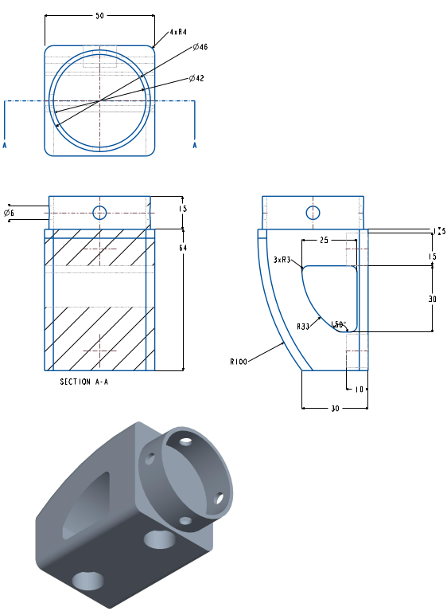

<h1>Leg Prosthesis</h1>

<h2>Description</h2>
During my bachelor studies, we had to prepare a simple object in Creo. Since I became fluent with the software, I decided to model something more advanced related to the Biomedical Engineering programme. The following leg prosthesis is a combination of the two articles linked below.

 

<h2>Software</h2>

* <b>Creo Parametric</b>

<h2>Project</h2>

 

Figure 1: Complete assembly of the prosthesis.

The assembly consists of the main parts: the leg case, the hydraulic system with a shaft, the prosthetic knee, and the tube that connects the upper section to the foot. The presented prosthesis may not be the most refined design, but it highlights the essential components found in a functional one.

 

Figure 2: Hydraulic system without the shaft.

 

Figure 3: Prosthetic knee and its layers.

Figure 3 shows the knee mechanism with its working functions. The scientific article used as the basis provided only measurements of the parts, so the design approach itself was entirely my own.

 

Figure 4: Foot reconstruction.

 

Figure 5: Engineering drawing of the foot holder.

As an example, I have included one of the engineering drawings of the foot holder, which connects the foot to the upper section.

<h2>Summary</h2>

According to the supervisor of my project: “So now what? Time to print!” Unfortunately, the lack of a 3D printer at that time was the only thing that prevented me from continuing. However, I gained experience working on projects that are larger and more complex than a simple mechanical part.

Overall, I am satisfied with the results, especially considering that this was my first project in CAD software. If I were to continue the project, I would adhere to the relevant ISO standards and apply bolt and hole metrics appropriate for the European market.

<h2>Sources</h2>

General concept: *Designing and Manufacturing of Lower Limb Prosthetic*
[https://www.pmu.edu.sa/attachments/academics/pdf/udp/coe/dept/me/16-designing-and-manufacturing-of-lower-limb-prosthetic.pdf](https://www.pmu.edu.sa/attachments/academics/pdf/udp/coe/dept/me/16-designing-and-manufacturing-of-lower-limb-prosthetic.pdf)

Foot inspiration:
[https://www.nature.com/articles/s41598-018-23705-8](https://www.nature.com/articles/s41598-018-23705-8)
